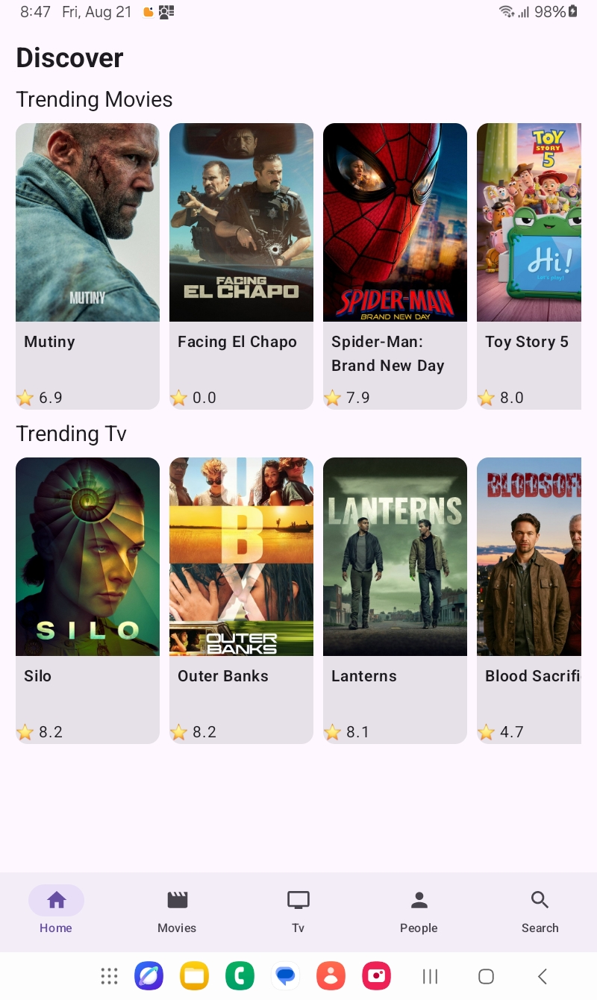
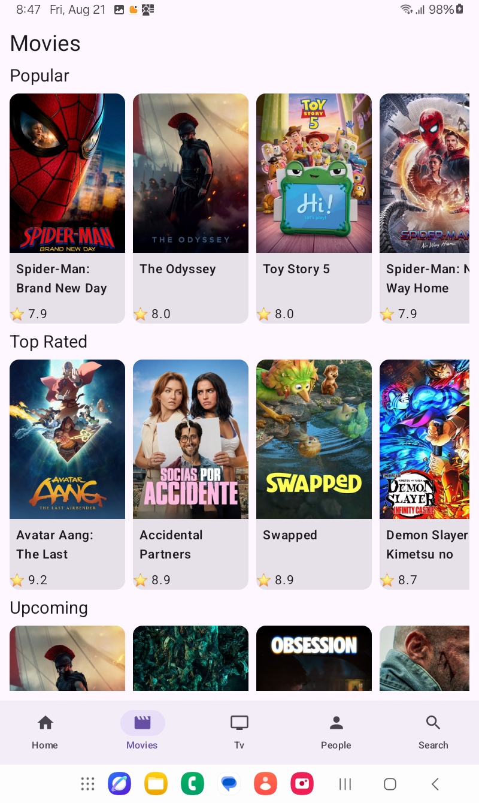
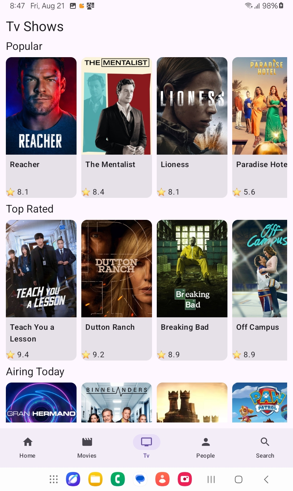
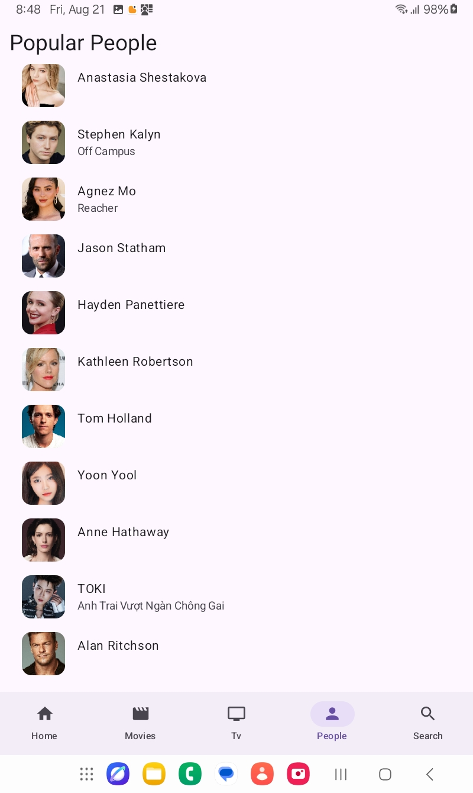

# TMDB-Movie-Tv-Shows-App
This project is intentionally multi-module. The original assessment asks for Clean Architecture and says multi-module is a plus; this implementation makes networking, database, domain, repository and each major feature independent modules.
##Screenshots

## Modules

- `:app` — application shell, Activity, navigation and Compose UI composition.
- `:core:common` — shared constants.
- `:core:network` — TMDB Retrofit API, DTOs, OkHttp and API-key interceptor.
- `:core:database` — Room database/DAO and persistence foundation.
- `:domain` — business models, repository contracts and use cases.
- `:data:repository` — repository implementation and Paging data sources.
- `:features:home` — discovery ViewModel.
- `:features:movies` — movie Paging ViewModel.
- `:features:tv` — TV Paging ViewModel.
- `:features:people` — people Paging ViewModel.
- `:features:search` — global search with debounce.
- `:features:detail` — movie/TV/person detail ViewModels.

## Dependency direction

`app → feature → domain`

`data:repository → domain + core:network + core:database`

Core modules have no dependency on feature modules.

## Setup

Copy `local.properties.example` to `local.properties` and add your TMDB API key:

`TMDB_API_KEY=YOUR_TMDB_API_KEY`

Open the root folder in Android Studio and run the `app` configuration.

## Built With 🛠
- [Kotlin](https://kotlinlang.org/) - First class and official programming language for Android development.
- [Coroutines](https://kotlinlang.org/docs/reference/coroutines-overview.html) - For asynchronous and more..
- [Flow](https://kotlin.github.io/kotlinx.coroutines/kotlinx-coroutines-core/kotlinx.coroutines.flow/-flow/) - A cold asynchronous data stream that sequentially emits values and completes normally or with an exception.
- [Android Architecture Components](https://developer.android.com/topic/libraries/architecture) - Collection of libraries that help you design robust, testable, and maintainable apps.
    - [Jetpack Compose](https://developer.android.com/jetpack/compose) - Modern way to make Ui in android kotlin.
    - [ViewModel](https://developer.android.com/topic/libraries/architecture/viewmodel) - Stores UI-related data that isn't destroyed on UI changes.
- [Dependency Injection](https://developer.android.com/training/dependency-injection) -
    - [Hilt-Dagger](https://dagger.dev/hilt/) - Standard library to incorporate Dagger dependency injection into an Android application.
    - [Hilt-ViewModel](https://developer.android.com/training/dependency-injection/hilt-jetpack) - DI for injecting `ViewModel`.
- [Retrofit](https://square.github.io/retrofit/) - A type-safe HTTP client for Android and Java.
- [Moshi](https://github.com/square/moshi) - A modern JSON library for Kotlin and Java.
- [Moshi Converter](https://github.com/square/retrofit/tree/master/retrofit-converters/moshi) - A Converter which uses Moshi for serialization to and from JSON.
- [Coil-kt](https://coil-kt.github.io/coil/) - An image loading library for Android backed by Kotlin Coroutines.
